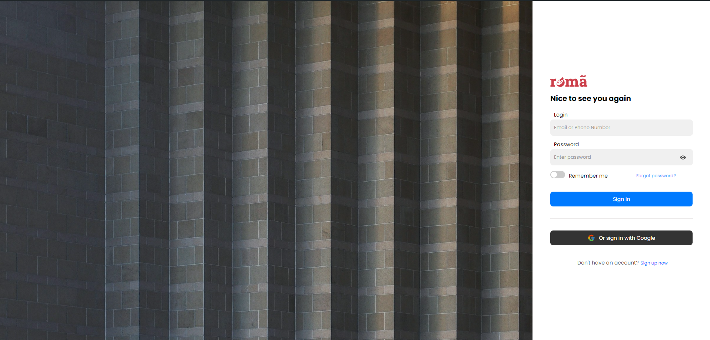
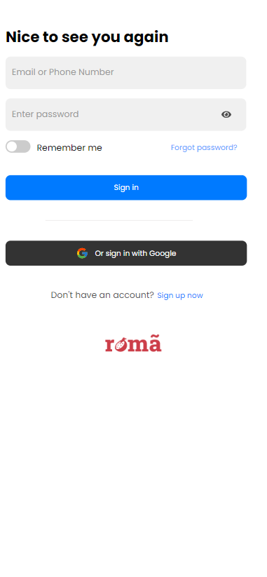

Página de Login Responsiva
Este repositório contém uma Página de Login Responsiva desenvolvida utilizando React.js. A página é totalmente responsiva, ajustando seu layout e elementos para diferentes tamanhos de tela, tornando-a adequada para usuários de desktop e mobile.

Funcionalidades
Design Responsivo: Adapta-se a diferentes tamanhos de tela (mobile, tablet, desktop).
Componentes React: Utiliza React para desenvolvimento baseado em componentes.
Interface Amigável: Design limpo e minimalista para fácil navegação.
Validação de Formulário: Validação básica do frontend usando React e JavaScript.
Tecnologias Utilizadas
React.js: Construção da interface com componentes reutilizáveis.
CSS3: Estilização dos componentes e garantia de responsividade com media queries.
JavaScript: Adição de funcionalidades dinâmicas e validação de formulários.
Pré-visualização

Instalação
Clone o repositório para sua máquina local:

bash
Copiar código
git clone https://github.com/mmagc/Responsive-Login-Page.git
Navegue até o diretório do projeto:

bash
Copiar código
cd Responsive-Login-Page
Instale as dependências necessárias:

bash
Copiar código
npm install
Inicie o servidor de desenvolvimento:

bash
Copiar código
npm start
Abra seu navegador e vá para http://localhost:3000 para ver a aplicação em ação.

Como Usar
Preencha seu nome de usuário e senha nos campos respectivos.
Clique no botão Login para enviar o formulário.
O formulário inclui validação básica para garantir que ambos os campos sejam preenchidos antes do envio.